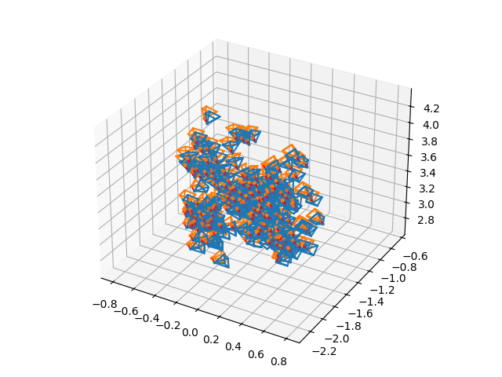

<div align="center">
  <p align="center">
      <picture>
      <source srcset="https://github.com/user-attachments/assets/a83ee3b1-5452-4614-84f0-662d8d0d9a7f" media="(prefers-color-scheme: dark)">
      <source srcset="https://github.com/user-attachments/assets/a83ee3b1-5452-4614-84f0-662d8d0d9a7f" media="(prefers-color-scheme: light)">
      
      </picture>

  </p>
  <p align="center">
    A differentiable point-based rendering library.
    <br />
    <a href="https://pointrix-project.github.io/pointrix/">
    <strong>Document🏠</strong></a>  | 
    <a href="https://pointrix-project.github.io/pointrix/index_cn.html">
    <strong>中文文档🏠</strong></a> | 
    <a href="https://pointrix-project.github.io/pointrix/">
    <strong>Paper(Comming soon)📄</strong></a> | 
    <a href="https://github.com/pointrix-project/msplat">
    <strong>Msplat Backend🌐</strong></a>
    <br />
    <br />
    <!-- <a href="https://github.com/othneildrew/Best-README-Template">View Demo</a>
    ·
    <a href="https://github.com/othneildrew/Best-README-Template/issues">Report Bug</a>
    ·
    <a href="https://github.com/othneildrew/Best-README-Template/issues">Request Feature</a> -->
  </p>
</div>

[](https://hits.seeyoufarm.com)


Pointrix is a differentiable point-based rendering library which has following properties:

- **Highly Extensible**:
  - Python API
  - Modular design for both researchers and beginners
  - Implementing your own method without touching CUDA
- **Powerful Backend**:
  - CUDA Backend
  - Forward Anything: rendering image, depth, normal, optical flow, etc.
  - Backward Anything: optimizing even intrinsics and extrinsics.
- **Rich Features**:
  - Support camera parameters optimization.
  - Support Dynmamic scene reconstruction task and Generation task (WIP).
  - Support mesh extraction and different type of initialization (WIP)

<!-- ## Comparation with original 3D gaussian code

### nerf_synthetic dataset (PSNR)

| Method                  | lego        | chair        | ficus        | drums        | hotdog        | ship        | materials        | mic        | average        |
| -----------             | ----------- | ----------- | ----------- | ----------- | ----------- | ----------- | ----------- | ----------- | ----------- |
| Pointrix | 35.84       | 36.12       | 35.02       | 26.18       | 37.81       | 30.98       | 29.95       | 35.34       |  33.40       |
| [original](https://github.com/graphdeco-inria/gaussian-splatting)        | 35.88        | 35.92        | 35.00        | 26.21        | 37.81        | 30.95        | 30.02        | 35.35        |   33.39       |

we obtain the result of 3D gaussian code by running following command in their repository.
```bash
 python train.py -s nerf_synthetic_root --eval -w
``` -->

## Quickstart

### Installation


Clone pointrix:

```bash
git clone https://github.com/pointrix-project/pointrix.git  --recursive
```

Create a new conda environment with pytorch:

```bash
conda create -n pointrix python=3.9
conda activate pointrix
conda install pytorch==2.1.1 torchvision==0.16.1 pytorch-cuda=12.1 -c pytorch -c nvidia
```

Install Pointrix and MSplat:

```bash
cd msplat
pip install .

cd ..
pip install -r requirements.txt
pip install -e .
```

(Optional) You can also install gsplat or diff-gaussian-rasterization:

```bash
pip install gsplat

git clone https://github.com/graphdeco-inria/diff-gaussian-rasterization.git
cd diff-gaussian-rasterization
python setup.py install
pip install .
```


###  Train Your First 3D Gaussian

#### Mip-NeRF 360 (Colmap format dataset)
Download the [data](http://storage.googleapis.com/gresearch/refraw360/360_v2.zip) and run:

```bash
cd pointrix/examples/gaussian_splatting
# For Mip-NeRF 360 data which have high-res images and need to downsample.
python launch.py --config ./configs/colmap.yaml trainer.datapipeline.dataset.data_path=your_data_path trainer.datapipeline.dataset.scale=0.25 trainer.output_path=your_log_path

# you can also use Msplat renderer or GSplat renderer
python launch.py --config ./configs/colmap.yaml trainer.datapipeline.dataset.data_path=your_data_path trainer.datapipeline.dataset.scale=0.25 trainer.output_path=your_log_path trainer.model.renderer.name=MsplatRender

python launch.py --config ./configs/colmap.yaml trainer.datapipeline.dataset.data_path=your_data_path trainer.datapipeline.dataset.scale=0.25 trainer.output_path=your_log_path trainer.conrtroler.normalize_grad=True trainer.model.renderer.name=GsplatRender
```

For other colmap dataset which do not need to downsample:

```bash
python launch.py --config ./configs/colmap.yaml trainer.datapipeline.dataset.data_path=your_data_path trainer.datapipeline.dataset.scale=1.0 trainer.output_path=your_log_path
```
if you want test your model:

```bash
cd pointrix/examples/gaussian_splatting
# For Mip-NeRF 360 data which have high-res images and need to downsample.
python launch.py --config ./configs/colmap.yaml trainer.datapipeline.dataset.data_path=your_data_path trainer.datapipeline.dataset.scale=0.25 trainer.output_path=your_log_path trainer.training=False trainer.test_model_path=your_model_path
```

<!-- #### Training Colmap dataset with Optimizing pose (Beta)

```bash
cd pointrix/projects/gaussian_splatting
python launch.py --config ./configs/colmap_dptr_pose_opt.yaml trainer.dataset.data_path=your_data_path
```

We add noise on colmap camera pose and then optimize it. The visualization of training process shows below:
<details>
<picture>
      
  </picture>
</details> -->

## Advanced Approaches

#### Camera optimization

To enable camera optimization, you should set trainer.model.camera_model.enable_training=True and trainer.optimizer.optimizer_1.camera_params.lr=1e-3:
The renderer must be setted as MsplatRender.

```bash
python launch.py --config ./configs/colmap.yaml trainer.datapipeline.dataset.data_path=your_data_path trainer.datapipeline.dataset.scale=1.0 trainer.output_path=your_log_path trainer.model.renderer.name=MsplatRender trainer.model.camera_model.enable_training=True trainer.optimizer.optimizer_1.camera_params.lr=1e-3
```


#### Mesh exstraction (WIP)

#### Dust3r initialization (WIP)

## Release Plans
- [ ] Nerf_synthetic dataset (this week).
- [ ] Dust3r initialization (this week).
- [ ] Mesh exstraction (this week).
- [ ] Introduction video (this week)
- [ ] Dynamic Gaussian Project(next week).

Welcome to discuss with us and submit PR on new ideas and methods.

## Acknowledgment
Thanks to the developers and contributors of the following open-source repositories, whose invaluable work has greatly inspire our project:

- [3D Gaussian Splatting](https://github.com/graphdeco-inria/gaussian-splatting): 3D Gaussian Splatting for Real-Time Radiance Field Rendering.
- [Threestudio](https://github.com/threestudio-project): A unified framework for 3D content creation
- [OmegaConf](https://github.com/omry/omegaconf): Flexible Python configuration system.
- [SSIM](https://github.com/Po-Hsun-Su/pytorch-ssim): pytorch SSIM loss implemetation.
- [GSplat](https://github.com/nerfstudio-project/gsplat): An open-source library for CUDA accelerated rasterization of gaussians with python bindings. 
- [detectron2](https://github.com/facebookresearch/detectron2): Detectron2 is Facebook AI Research's next generation library that provides state-of-the-art detection and segmentation algorithms. 


This is project is licensed under Apache License. However, if you use MSplat or the original 3DGS kernel in your work, please follow their license.

## Contributors
<a href="https://github.com/pointrix-project/pointrix/graphs/contributors">
  
</a>

Made with [contrib.rocks](https://contrib.rocks).

