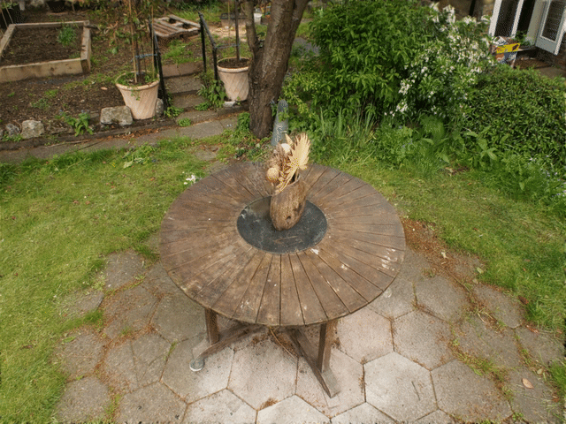
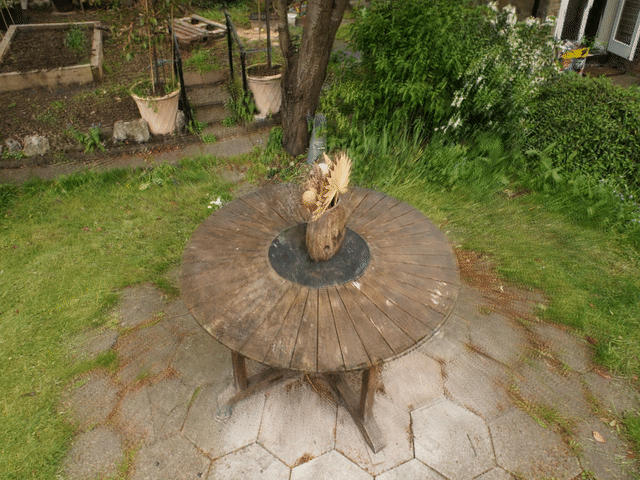

# Dust3r 初始化相机模型与点云 (Beta)

## 使用方法：
1. 切换到Beta 分支
2. 下载[Dust3r](https://github.com/naver/dust3r)到`examples/dust3r_init`并依照指示安装
3. 将`convert_dust3r.py` 移动到 `examples/dust3r_init/dust3r`文件夹下
4. cd examples/dust3r_init/dust3r, 然后用dust3r 提取点云先验与相机先验：

```bash
python convert_dust3r.py --model_path your_dust3r_weights --filelist your_image_path
```

5. 运行程序

```{note}
Dust3r 一次只能提取数十张图片的点云和相机先验。
```

## 实验结果：

使用十二张图片在Garden 场景下的实验结果：


如关闭相机优化，则渲染精度会降低，如下图所示：
