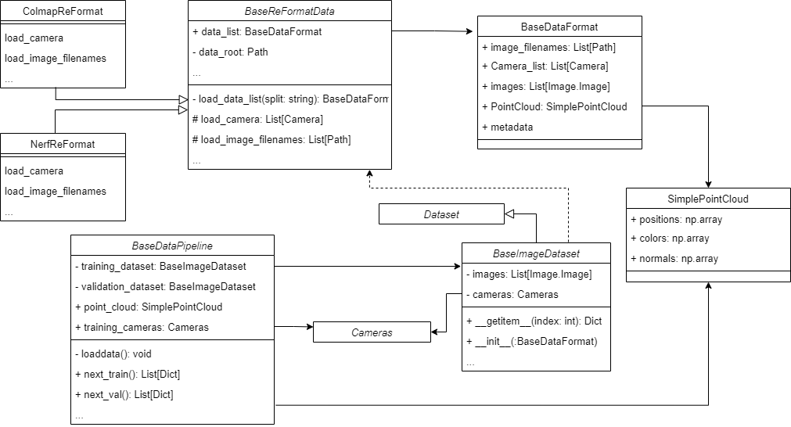
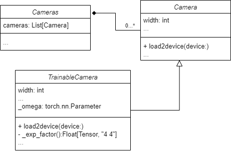

# Datapipeline

As shown in the diagram below, the data pipeline consists of two parts: **Dataset**, and **DataPipeline**

- **Dataset**: Processes data in the standard format and supports batch size indexing in conjunction with DataLoader. Users usually do need to overide this part if
they want to customize these. 


- **DataPipeline**: The standard data flow in Pointrix provides a stable data stream for the trainer. The key function of this class is `next_train()` and `next_val()`, this two function can return a batch (a Python list of Python's Dictionary consisted by the Dataset's content). And this batch will be used in rendering and loss computation.




## The Procedure of the Data Read

1. The trainer's init function call the construction function of the DataPipleline, and build the association to this DataPipeline object.
2. To construct DataPipleline object, the DataPipeline call the specific ReFormatData class as a tool to get the standard DataFormat object for trainning and validation, respectively. And these two standard DataFormat objects will be converted to two Dataset class objects, immediately. And the latter will be associated to the datapipeline for the whole life cycle.
3. Datapipeline will also save the SimplePointCloud object associated with BaseDataFormat. And this SimplePointCloud will be used to initialize the model's pointcloud if it wasn't set as random in configuration.  
4. The train class call the "next_train" function one times per trainning iteration to get a batch used for rendering and loss computation. The same in the validation loop.

## The Detail of Each Part

### ReformatData

You have to implement `load_camera()` and `load_image_filenames()` if you want to create a support to a new kind of dataset format. 

Whenever the BaseReFormatData was created, the "load_data_list" will be called, and the overrode function of detail loading will be called. After the instance is created, you can get BaseFormat object by call its variable `data_list`.

```python
class BaseReFormatData:
    """
    The foundational classes for formating the data.

    Parameters
    ----------
    data_root: Path
        The root of the data.
    split: str
        The split of the data.
    cached_image: bool
        Whether to cache the image in memory.
    scale: float
        The scene scale of data.
    """

    def __init__(self, data_root: Path, ...

    def load_data_list(self, split) -> BaseDataFormat:
        """
        The foundational function for formating the data

        Parameters
        ----------
        split: The split of the data.
        """
        camera = self.load_camera(split=split)
        image_filenames = self.load_image_filenames(camera, split=split)
        metadata = self.load_metadata(split=split)
        pointcloud = self.load_pointcloud()
        data = BaseDataFormat(image_filenames, camera,
                              PointCloud=pointcloud, metadata=metadata)
        return data

    @abstractmethod
    def load_camera(self, split) -> List[Camera]: ...

    def load_pointcloud(self) -> SimplePointCloud: ...
        """
        The function for loading the Pointcloud for initialization of gaussian model.
        """
        return None

    @abstractmethod
    def load_image_filenames(self, split) -> List[Path]: ...

    def load_metadata(self, split) -> Dict[str, Any]: ...

    def load_all_images(self) -> List[Image.Image]: ...

```

### DataFormat

The code below shows a typical DataFormat class. You don't need to write a new one usually.

As the example shows, you need to give it a image filename list, a camera list and an optional metadata information to generate a BaseDataFormat object.

```python
@dataclass
class BaseDataFormat:
    """
    Pointrix standard data format in Datapipeline.

    Parameters
    ----------
    image_filenames: List[Path]
        The filenames of the images in data.
    Cameras: List[Camera]
        The camera parameters of the images in data.
    images: Optional[List[Image.Image]] = None
        The images in data, which are only needed when cached image is enabled in dataset.
    PointCloud: Union[SimplePointCloud, None] = None
        The pointclouds of the scene, which are used to initialize the gaussian model, enabling better results.
    metadata: Dict[str, Any] = field(default_factory=lambda: dict({}))
        Other information that is required for the dataset.

    Notes
    -----
    1. The order of all data needs to be consistent.
    2. The length of all data needs to be consistent.

    Examples
    --------
    >>> data = BaseDataFormat(image_filenames, camera, metadata=metadata)

    """

    image_filenames: List[Path]
    """camera image filenames"""
    Camera_list: List[Camera]
    """camera image list"""
    images: Optional[List[Image.Image]] = None
    """camera parameters"""
    PointCloud: Union[SimplePointCloud, None] = None
    """precompute pointcloud"""
    metadata: Dict[str, Any] = field(default_factory=lambda: dict({}))
    """other information that is required for the dataset"""

    ...
```

### Dataset

You can override the Python's Dataset class to create your own Dataset. But typically you have to support using BaseDataFormat to create Dataset, 
and also support to use `[]` to get the image-related information, which will be used in rendering and loss computation. The example BaseImageDataset is shown below.

```python
    def __init__(self, format_data: BaseDataFormat) -> None:
        self.camera_list = format_data.Camera_list
        self.images = format_data.images
        self.image_file_names = format_data.image_filenames

        self.cameras = Cameras(self.camera_list)
        self.radius = self.cameras.radius

        if self.images is not None:
        # Transform cached images.
            self.images = [self._transform_image(
                image) for image in self.images]
```

```python
	def __getitem__(self, idx):
        image_file_name = self.image_file_names[idx]
        camera = self.camera_list[idx]
        image = self._load_transform_image(
            image_file_name) if self.images is None else self.images[idx]
        camera.height = image.shape[1]
        camera.width = image.shape[2]
        return {
            "image": image,
            "camera": camera,
            "FovX": camera.fovX,
            "FovY": camera.fovY,
            "height": camera.image_height,
            "width": camera.image_width,
            "world_view_transform": camera.world_view_transform,
            "full_proj_transform": camera.full_proj_transform,
            "camera_center": camera.camera_center,
        }
```

### DataPipeline

The DataPipeline is the interface that can be used for trainer and other part of the framework. 

The creation of a Datapipeline means that the dataset is loaded. And trainer can use `next_train()` and `next_val()` to get a new batch of data. Whether using Python's DataLoader can be chosen by yourself.

The SimplePointCloud can be found if you have a datapipeline. It can be used to initialize the Gaussian model's point cloud. At the same time, the cameras' parameters are associated to DataPipeline too.

### Camera



#### Camera

- Contains the initialization of the camera, ranging from store some basic parameters and pre-compute some information such as view transformation matrix.
- Contains the function loading all the parameters of the camera to the device.
- The specific parameters and implementation can be access in the code.

#### TrainableCamera

- Contains converting a batch of logarithmic representations of SE(3) matrices `log_transform`  to a batch of 4x4 SE(3) matrices using the exponential map, which can help us use 6D vectors to represent rigid transformation.
- The 6D vectors representing transformation to the origin camera will also be load to device (GPU).

#### Cameras

- Contains a list of cameras.

