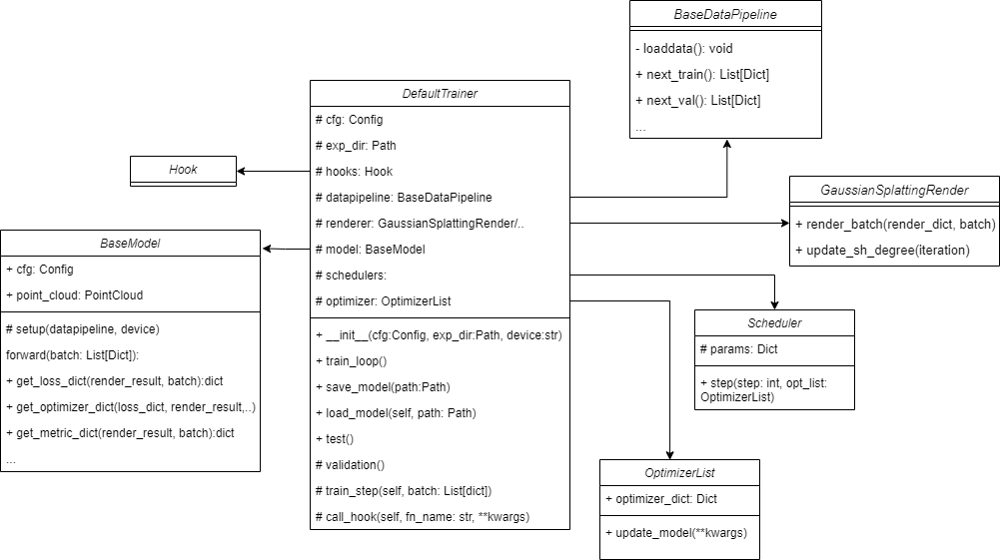

# Trainer

The Trainer provides a complete default training pipeline, including **initialization** of hooks, data pipelines, renderers, models, optimizers, and loggers, as well as the **train_step**, **train_loop**, and **validation** processes.

The Relationship between Trainer to other modules is shown below:



## DefaultTrainer 

The DefaultTrainer is a class for training and testing models, and its framework mainly includes the following parts:

- Initialization: In the initialization phase, DefaultTrainer builds the training environment according to the configuration file and the experiment directory. This includes parsing the configuration file, constructing the data pipeline, renderer, model, optimizer, scheduler, and hook.

- Training Loop: The `train_loop` method defines the entire training process. It updates the model parameters in each training step and validates the model at each validation interval. The `train_step` method defines the process of each training step. It first obtains the rendering results through the model, then calculates the loss, and finally updates the model parameters through the optimizer. The `validation` method is called at regular intervals and used to evaluate the performance of the model on the validation set. It traverses all the data in the validation set, renders each data, and then calculates the evaluation metrics. 
- Test: The `test` method is used to evaluate the performance of the model on the test set. It first loads the model, then renders the data of the test set, and saves the rendering results such as some novel view images. 
- Load and Save: The `save_model` and `load_model` methods are used to save and load the model. The state of the model is saved in a dictionary, which includes the global steps, the state of the optimizer, the state of the model, and the state of the renderer.
- Hook Fuction: The `call_hook` method is used to call hook functions. Hook functions are functions that are executed at specific stages (such as the start of training, the end of training, before and after each training step, etc.) and can be used to implement some custom functions.

```{note}
You can also define your own training process by define hook function or inherit the DefaultTrainer class and add your modification.
```

## Data Flow

In this framework, the flow of data mainly goes through the following steps:

1. Data Loading: Load training data and validation data through the data pipeline.
2. Training:
   - Forward Propagation: Input the **training dataset** into the model, perform forward propagation, and get the **rendering results**.
   - Loss Calculation: Calculate the **loss dictionary** based on the rendering results and the real data.
   - Backward Propagation and Parameter Update: Perform backward propagation based on the loss, and then generate **optimizer dictionary** to update the **model parameters** and **structures** through the optimizer.
   - Validation: In the validation stages (called at regular intervals), the steps of data loading, forward propagation, and calculation of evaluation metrics are also performed, but backward propagation and **parameter updates are not performed**.
3. Save Model: At specific steps in the training process, or at the end of training, the state of the model is saved.

```{note}
If you want to test the effect of the model, just call the `test()` method and it will load the model and render image to evaluate the model.
```